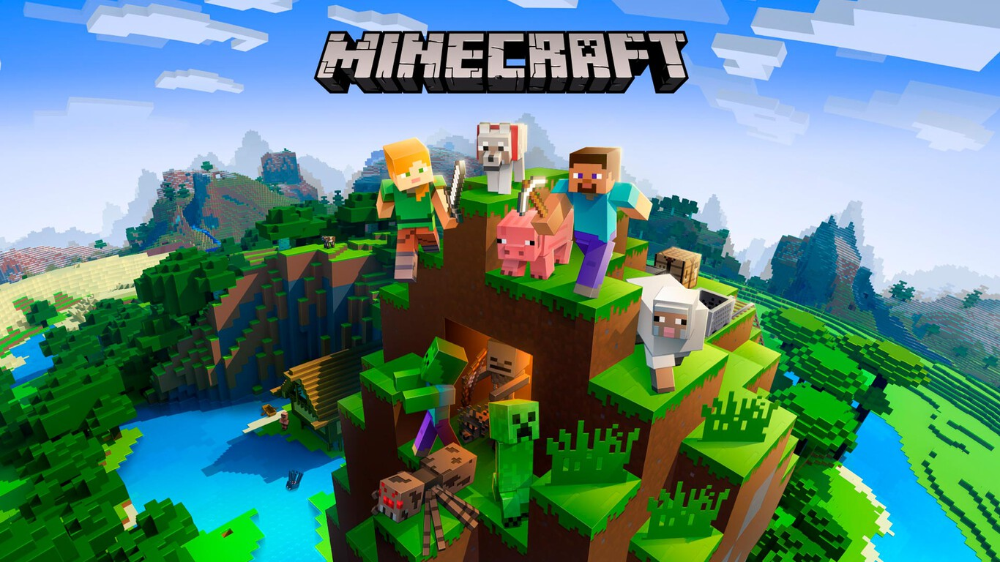

# PROG-UD5-MINECRAFT_ANA

- Autor:
  - Nombre:
    - Ana Isabel González Rosales
  - Fecha:
    - Mayo 2023
  - git:
    - https://github.com/AnaIsabelValle/PROG-UD5-MINECRAFT-ANA.git

## Introducción:

Nos solicitan que realicemos una simulación de un antigüo videojuegos, dónde interactúa el usuario con varios mobs aleatorios del juego Minecraft.
## Análisis:

Se basa en implentación de clases abstractas e interfaces.

Al inicializar el programa, el usuario escogerá un mobs de los que se ha implentado y el personaje deberá intentar eliminarlo con patrones aleatorios.

## Sintaxis:

1. Creación de paquetes:
   1. Paquete raíz llamado **com**, incluye:
      1. Paquete **minecraft**, que se componen de :
         1. Paquete **minecraft_ana**
            1. Paquete **entidades**
            2. Paquete **interfaces**
      
2. Creación de clases:
   1. En el paquete **entidades** se han creado las siguientes clases:
      1. **Personaje**, implementada la interfaz Combate
      2. **Mob** "Abstracta"
      3. **MobHostil** "Abstracta",extiende de Mob, implementada la inferfaz Combate
      4. **MobPacifico** "Abstracta",extiende de Mob, implementada la interfaz Daño
      5. **Zombie** extiende de MobHostil
      6. **Enderman** extiende de MobHostil
      7. **Oveja** extiendde de MobPacifico
        
   2. En el paquete **interfaces**, se han implementado:
      1. La interfaz **Daño**
      2. La interfaz **Combate** que extiende de Daño
      
3. En la clase ejecutable **App**:
   1. Preguntar al usuario que arma quiere utilizar
   2. Preguntar al usuario que armadura quiere utilizar
   3. Instanciar el personaje
   4. Instaciar el enemigo
   5. Comenzar el combate
      1. El personaje solo atacará al enemigo
      2. El enemigo, podrá aleatoriamente atacar o moverse
      3. Finalizará cuando el personaje o el enemigo se queden sin salud
      4. Y se mostrará quién ha salido victorioso